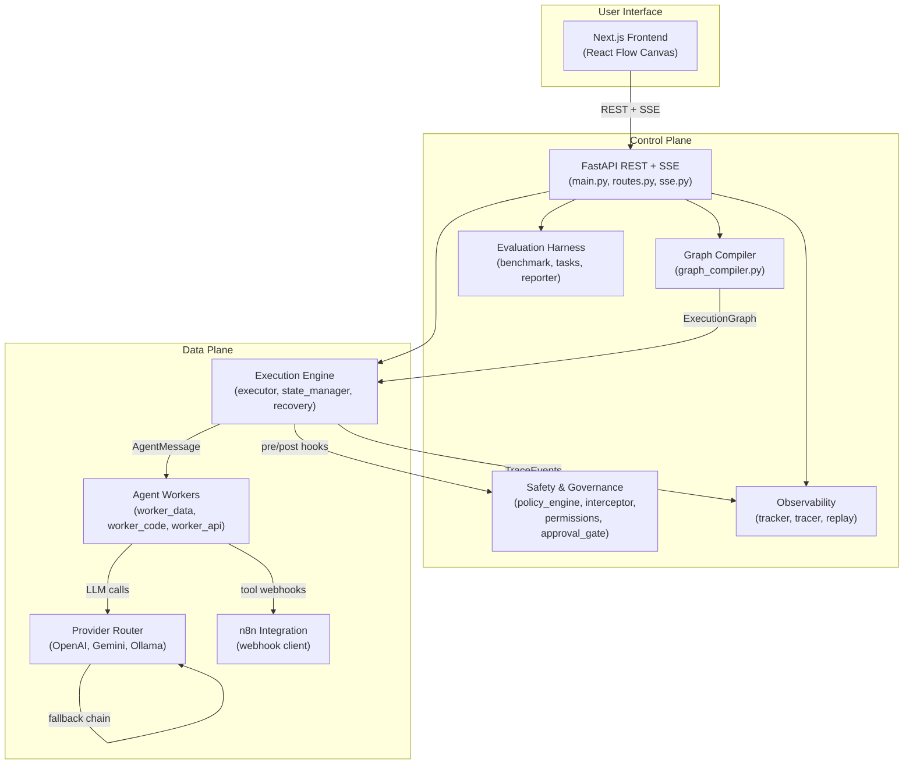
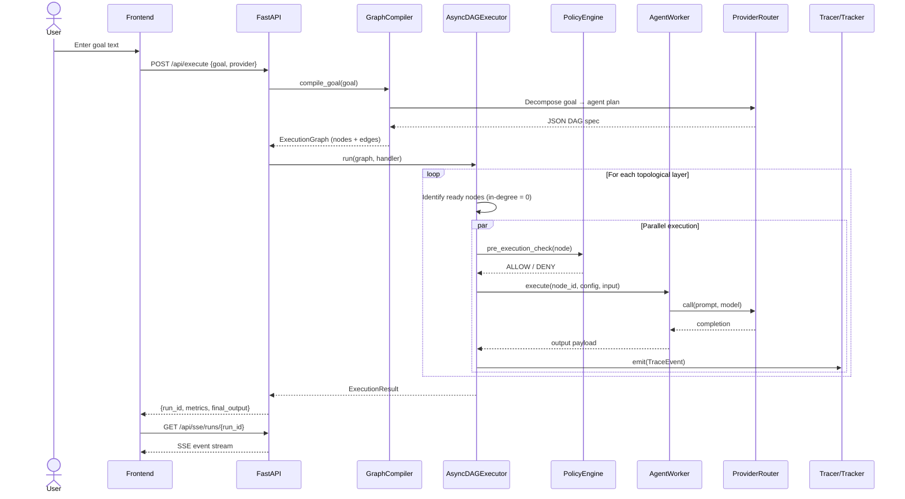
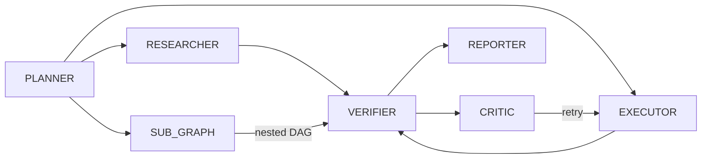
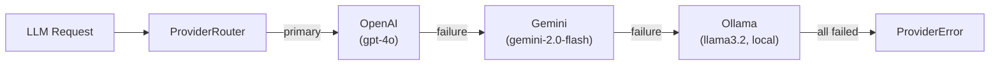
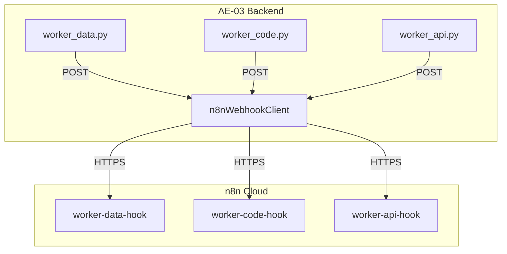
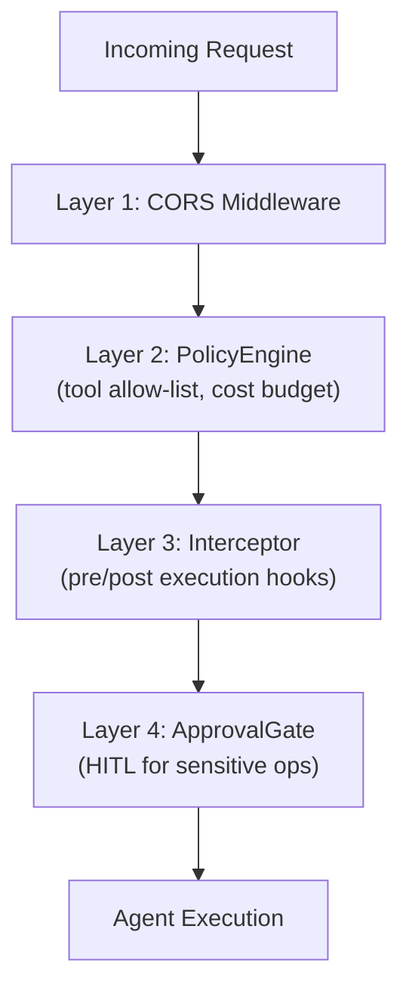

# AE-03: System Architecture Document

> **Version**: 1.0.0 · **Last Updated**: 2026-08-07 · **Status**: Complete (Modules 1–11)

---

## 1. Overview

AE-03 is a production-grade multi-agent orchestration system that:

1. Accepts **natural-language goals** from a user
2. **Compiles** them into typed Directed Acyclic Graphs (DAGs) of specialised agents
3. **Executes** the DAG with parallel fan-out, failure recovery, and safety governance
4. Provides **real-time observability**, run **replay**, and **benchmark evaluation**

The system is split into a **Control Plane** (compilation, governance, observability) and a **Data Plane** (agent execution, tool invocation, provider communication).

---

## 2. High-Level Architecture



---

## 3. Component Map

### Module Dependency Matrix

| Module | Package | Depends On | Depended By |
| :--- | :--- | :--- | :--- |
| **M1** Scaffolding | `config`, `schemas/` | — | All modules |
| **M2** Providers | `providers/` | M1 | M3, M4, M5, M10 |
| **M3** Compiler | `compiler/` | M1, M2 | M5, M10 |
| **M4** n8n & Workers | `integrations/`, `agents/` | M1, M2 | M5 |
| **M5** Execution Engine | `engine/` | M1, M3, M4 | M6, M7, M8, M10 |
| **M6** Safety & HITL | `safety/` | M1, M5 | M7, M10 |
| **M7** Observability | `observability/` | M1, M5 | M8, M10 |
| **M8** Evaluation | `evaluation/` | M1, M5, M7 | M10 |
| **M9** Frontend | `frontend/` | — | M10 |
| **M10** E2E Integration | `api/`, `main.py`, `scripts/` | All | M11 |
| **M11** Documentation | `docs/` | All | — |

### File Manifest

```
c:\hack/
├── .env.example                          # API key template
├── requirements.txt                      # Python dependencies
├── backend/
│   ├── __init__.py
│   ├── main.py                           # FastAPI app entry point
│   ├── config.py                         # Environment vault (pydantic-settings)
│   ├── api/
│   │   ├── routes.py                     # 10 REST endpoints
│   │   └── sse.py                        # 2 SSE streaming endpoints
│   ├── schemas/
│   │   ├── contracts.py                  # Core Pydantic models
│   │   └── artifacts.py                  # Trace, report, benchmark models
│   ├── providers/
│   │   ├── base.py                       # Abstract LLM provider
│   │   ├── openai_provider.py            # OpenAI GPT integration
│   │   ├── gemini_provider.py            # Google Gemini integration
│   │   ├── ollama_provider.py            # Local Ollama integration
│   │   └── router.py                     # Provider router + fallback chain
│   ├── compiler/
│   │   ├── prompt_templates.py           # System prompt templates
│   │   ├── graph_compiler.py             # Goal → DAG compiler
│   │   └── validator.py                  # Kahn's algorithm + cycle detection
│   ├── integrations/
│   │   └── n8n_client.py                 # n8n webhook HTTP client
│   ├── agents/
│   │   ├── worker_data.py                # Researcher agent
│   │   ├── worker_code.py                # Code executor agent
│   │   └── worker_api.py                 # API integration agent
│   ├── engine/
│   │   ├── executor.py                   # Async DAG executor
│   │   ├── state_manager.py              # SharedMemory + TTL scratch
│   │   └── recovery.py                   # Retry + compensation
│   ├── safety/
│   │   ├── policy_engine.py              # Standalone policy evaluator
│   │   ├── permissions.py                # Permission models + defaults
│   │   ├── interceptor.py                # Pre-execution middleware
│   │   └── approval_gate.py              # HITL approval gate
│   ├── observability/
│   │   ├── tracker.py                    # Token/cost tracker
│   │   ├── tracer.py                     # Event trace logger + RunStore
│   │   └── replay.py                     # Run replay engine
│   ├── evaluation/
│   │   ├── tasks.py                      # Task loader from DATA_PROVENANCE
│   │   ├── benchmark.py                  # 3-mode benchmark runner
│   │   └── reporter.py                   # Marginal value report
│   └── tests/
│       ├── test_e2e_mvd.py               # E2E MVD test suite
│       └── inject_failure.py             # Failure injection utilities
├── frontend/
│   ├── app/
│   │   ├── globals.css                   # Premium dark design system
│   │   ├── layout.tsx                    # Root layout
│   │   └── page.tsx                      # Main orchestrator page
│   └── components/
│       ├── GraphCanvas.tsx               # React Flow DAG canvas
│       ├── MetricsPanel.tsx              # Live metrics panel
│       └── ApprovalModal.tsx             # HITL approval modal
├── evaluation/
│   └── DATA_PROVENANCE.md                # Benchmark data sources + tasks
├── docs/
│   ├── ARCHITECTURE.md                   # This document
│   ├── THREAT_MODEL.md                   # Security threat model
│   └── REPRODUCIBILITY.md               # Reproduction guide
├── scripts/
│   └── run_demo.ps1                      # Single-command demo launcher
└── n8n_workflows/
    ├── worker_code_workflow.json          # n8n code executor workflow
    ├── worker_data_workflow.json          # n8n data researcher workflow
    └── worker_api_workflow.json           # n8n API integration workflow
```

---

## 4. Data Flow — End-to-End Request Lifecycle



---

## 5. Agent Role Taxonomy

AE-03 defines **8 specialised agent roles**, each with distinct responsibilities and tool permissions:

| Role | Responsibility | Allowed Tools | Example |
| :--- | :--- | :--- | :--- |
| **PLANNER** | Decomposes goal into sub-tasks | — | "Split into research + execution" |
| **RESEARCHER** | Gathers information from data sources | `web_search`, `db_query` | "Find API docs for Stripe" |
| **EXECUTOR** | Executes code, transforms data | `code_execute`, `file_write` | "Run the data pipeline" |
| **VERIFIER** | Validates outputs against schemas | `validate_output` | "Check response matches schema" |
| **REPORTER** | Synthesises final deliverable | `format_report` | "Generate markdown report" |
| **CRITIC** | Reviews and suggests improvements | — | "The code lacks error handling" |
| **ROUTER** | Dynamic dispatch to sub-specialists | — | "Route to code vs data worker" |
| **SUB_GRAPH** | Encapsulates a nested sub-workflow | (delegates to child graph) | "Run auth audit sub-workflow" |

### Role Interaction Pattern



---

## 6. Provider Abstraction Layer

### Multi-LLM Fallback Chain



**Key features:**
- **Automatic fallback**: If the primary provider fails (timeout, rate limit, 500), the router tries the next in the chain
- **Per-provider cost tracking**: Each call records prompt tokens, completion tokens, and USD cost
- **Usage stats**: Call count, failure count, total cost per provider
- **Model override**: Any endpoint can override the default model per request

---

## 7. n8n Integration Surface

### Webhook Bus Topology



**Payload contract:** All webhook calls use `WebhookPayload` (Pydantic model) containing `run_id`, `node_id`, `action`, `params`, and `metadata`.

---

## 8. Execution Engine Internals

### DAG Traversal Algorithm

1. **Topological sort** via Kahn's algorithm (cycle detection)
2. **Layer-by-layer execution**: Nodes with in-degree 0 form a layer
3. **Parallel fan-out**: All nodes within a layer run concurrently via `asyncio.gather()`
4. **Join synchronisation**: A node waits until all parent outputs are available
5. **Sub-graph delegation**: `SUB_GRAPH` nodes spawn a child `AsyncDAGExecutor`

### Retry & Compensation

| Mechanism | Trigger | Action |
| :--- | :--- | :--- |
| **Exponential backoff** | Node failure (retryable) | Retry up to `max_retries` with `base_delay * 2^attempt` |
| **Compensation** | Node failure (non-retryable) | Execute registered compensation handler for the node |
| **Circuit breaker** | Consecutive failures > threshold | Mark node as FAILED, skip downstream |

### TTL Memory Eviction

`ExecutionState.scratch_memory` uses time-based eviction:
- Default TTL: 300 seconds
- Entries are evicted on read if expired
- Prevents unbounded memory growth in long-running executions

---

## 9. Security Architecture

### Defence-in-Depth Layers



| Layer | Component | What it checks |
| :--- | :--- | :--- |
| **1** | CORS Middleware | Origin whitelist (localhost:3000, 3001, 8000) |
| **2** | PolicyEngine | Tool in `allowed_tools`, cost < `max_cost_per_run`, depth < `max_graph_depth` |
| **3** | Interceptor | Pre-execution: validate inputs; Post-execution: validate outputs |
| **4** | ApprovalGate | Sensitive tools require human approval before execution |

---

## 10. API Surface Summary

### REST Endpoints (10)

| Method | Path | Description |
| :--- | :--- | :--- |
| GET | `/api/health` | Health check |
| POST | `/api/compile` | Compile goal → DAG |
| POST | `/api/execute` | Compile + execute |
| GET | `/api/runs` | List runs |
| GET | `/api/runs/{id}` | Get run detail |
| GET | `/api/runs/{id}/export` | Export trace JSON |
| POST | `/api/replay` | Replay with hot-swap |
| POST | `/api/approve` | HITL approval |
| GET | `/api/providers` | List providers |
| GET | `/api/benchmark/summary` | Benchmark tasks |

### SSE Endpoints (2)

| Method | Path | Description |
| :--- | :--- | :--- |
| GET | `/api/sse/runs/{id}` | Stream stored run events |
| GET | `/api/sse/demo` | Simulated demo stream |

---

## 11. Technology Stack

| Layer | Technology | Version |
| :--- | :--- | :--- |
| **Backend** | Python | 3.13 |
| | FastAPI | ≥ 0.115 |
| | Pydantic | ≥ 2.10 |
| | uvicorn | ≥ 0.30 |
| | httpx | ≥ 0.27 |
| | sse-starlette | ≥ 2.0 |
| **LLM Providers** | OpenAI SDK | ≥ 1.50 |
| | Google Generative AI | ≥ 0.8 |
| | Ollama (local) | latest |
| **Frontend** | Next.js | 16.3.0 |
| | React | 19.2.8 |
| | @xyflow/react | 12.11.2 |
| | lucide-react | 1.29.0 |
| | TypeScript | 5.x |
| **Integration** | n8n Cloud | webhooks |
