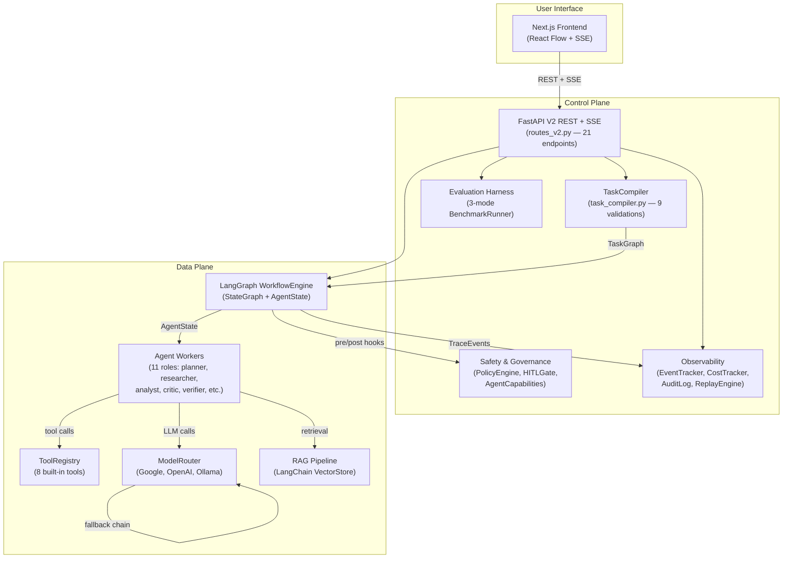
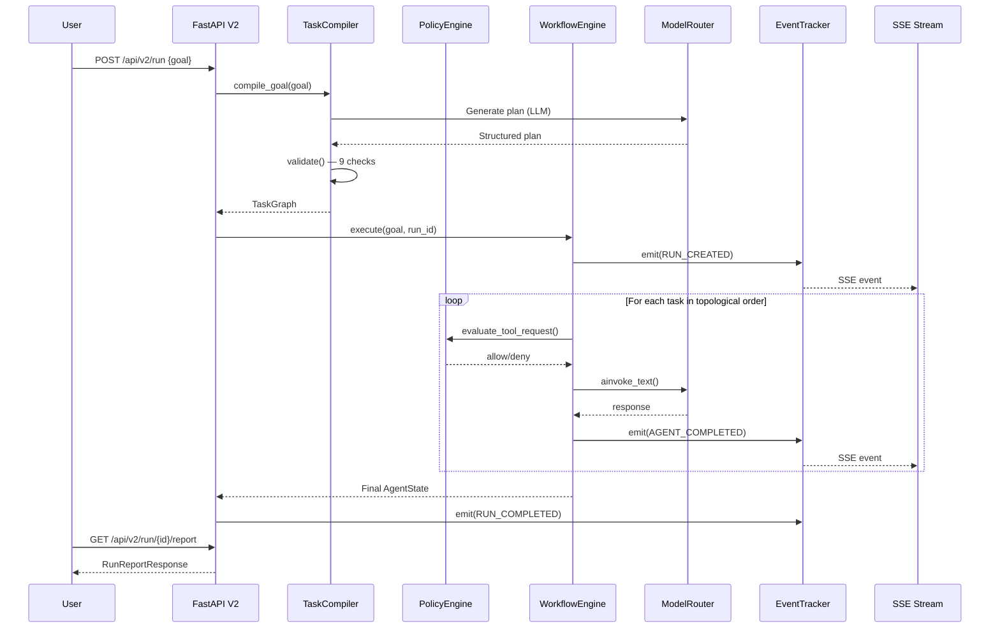

# AE-03: System Architecture Document (Directive V2)

> **Version**: 2.0.0 · **Last Updated**: 2026-08-07 · **Status**: Complete (Modules 1–11)

---

## 1. Overview

AE-03 is a production-grade multi-agent orchestration system built on **LangGraph** that:

1. Accepts **natural-language goals** from a user
2. **Compiles** them via `TaskCompiler` into validated `TaskGraph` DAGs of specialised agents
3. **Executes** the DAG through `WorkflowEngine` (`StateGraph`) with parallel fan-out, failure recovery, and deny-by-default security
4. Provides **real-time SSE observability**, run **replay**, HITL approvals, and **3-mode benchmark evaluation**
5. Exposes **21 V2 REST API endpoints** covering execution, observability, security, and RAG

The system is split into a **Control Plane** (compilation, governance, observability) and a **Data Plane** (LangGraph execution, tool invocation, provider communication).

---

## 2. High-Level Architecture



---

## 3. Component Map

### Module Dependency Matrix

| Module | Package | Key Classes | Depends On |
| :--- | :--- | :--- | :--- |
| **M1** Config & Schemas | `config.py`, `schemas/` | `AppSettings`, `AgentRole`, `Task`, `TaskGraph` | — |
| **M2** Model Router | `models/` | `ModelRouter`, `ProviderConfig` | M1 |
| **M3** Tool Registry | `tools/` | `ToolRegistry`, `ToolConfig` | M1 |
| **M4** Task Compiler | `graph/task_compiler.py` | `TaskCompiler`, `ValidationResult` | M1, M2, M3 |
| **M5** Workflow Engine | `graph/workflow.py`, `graph/agent_state.py` | `WorkflowEngine`, `AgentState` (21 fields), `ScratchpadManager` | M1, M4 |
| **M6** Policy & HITL | `safety/` | `PolicyEngine` (6 rules), `HITLGate`, `AgentCapability` (11 roles) | M1 |
| **M7** Observability | `observability/` | `EventTracker` (25 types), `CostTracker`, `AuditLog`, `ReplayEngine` | M1 |
| **M8** API Endpoints | `api/routes_v2.py` | 21 V2 REST endpoints + SSE | M1-M7 |
| **M9** Frontend | `frontend/` | React Flow + V2 API client + SSE | M8 |
| **M10** Security Tests | `tests/test_security_suite.py` | 50 tests, 18 categories | M1-M8 |
| **M11** Documentation | `docs/` | ARCHITECTURE, THREAT_MODEL, REPRODUCIBILITY | All |

### File Manifest (Post-Migration)

```
c:\hack/
├── backend/
│   ├── config.py                          # AppSettings (Pydantic)
│   ├── main.py                            # FastAPI lifespan + V2 router
│   ├── api/
│   │   ├── routes_v2.py                   # 21 V2 REST endpoints
│   │   └── routes.py / sse.py             # V1 (deprecated, graceful fallback)
│   ├── graph/
│   │   ├── agent_state.py                 # AgentState TypedDict (21 fields)
│   │   ├── task_compiler.py               # TaskCompiler (9 validations)
│   │   └── workflow.py                    # WorkflowEngine (LangGraph StateGraph)
│   ├── models/
│   │   └── model_router.py                # ModelRouter (Google, OpenAI, Ollama)
│   ├── tools/
│   │   └── tool_registry.py               # ToolRegistry (8 built-in tools)
│   ├── safety/
│   │   ├── agent_config.py                # AgentCapability matrix (11 roles)
│   │   ├── policy_engine.py               # PolicyEngine (6-rule deny chain)
│   │   ├── hitl_gate.py                   # HITLGate (LangGraph interrupt())
│   │   └── permissions.py                 # Role permissions
│   ├── observability/
│   │   ├── tracker.py                     # EventTracker (25 event types)
│   │   ├── tracer.py                      # CostTracker + AuditLog
│   │   └── replay.py                      # ReplayEngine
│   ├── rag/
│   │   ├── pipeline.py                    # RAGPipeline (LangChain)
│   │   └── vector_store.py                # VectorStore (ChromaDB/FAISS)
│   ├── evaluation/
│   │   ├── benchmark.py                   # BenchmarkRunner (3 modes)
│   │   ├── reporter.py                    # BenchmarkReporter
│   │   └── tasks.py                       # Task loader (DATA_PROVENANCE.md)
│   ├── schemas/
│   │   ├── contracts.py                   # 20+ Pydantic models
│   │   └── artifacts.py                   # RunReport, BenchmarkResult
│   └── tests/
│       └── test_security_suite.py         # 50 tests, 18 categories
├── frontend/
│   ├── app/page.tsx                       # V2 API + SSE + demo fallback
│   ├── lib/api.ts                         # V2 API client (typed)
│   └── components/
│       ├── GraphCanvas.tsx                # React Flow (11 role icons)
│       ├── MetricsPanel.tsx               # Live metrics + event log
│       └── ApprovalModal.tsx              # HITL approval UI
├── scripts/
│   └── run_demo.ps1                       # Single-command launcher
└── docs/
    ├── ARCHITECTURE.md                    # This document
    ├── THREAT_MODEL.md                    # 15 threat categories
    └── REPRODUCIBILITY.md                 # Setup & reproduction guide
```

---

## 4. Data Flow

### Goal → Execution → Report Pipeline



---

## 5. Agent Architecture

### 11 Directive V2 Agent Roles

| Role | LLM | Network | Code Exec | RAG | Tools | Purpose |
| :--- | :---: | :---: | :---: | :---: | :---: | :--- |
| ORCHESTRATOR | ✅ | ❌ | ❌ | ❌ | ❌ | Top-level coordination |
| PLANNER | ✅ | ❌ | ❌ | ❌ | ❌ | Goal decomposition |
| RESEARCHER | ✅ | ✅ | ❌ | ✅ | ✅ | Information gathering |
| RAG | ❌ | ❌ | ❌ | ✅ | ✅ | Document retrieval |
| TOOL_EXECUTION | ✅ | ✅ | ✅ | ❌ | ✅ | Tool invocation |
| ANALYST | ✅ | ✅ | ❌ | ✅ | ✅ | Data analysis |
| CRITIC | ✅ | ❌ | ❌ | ❌ | ❌ | Quality review |
| VERIFIER | ✅ | ❌ | ❌ | ❌ | ❌ | Output verification |
| SECURITY | ❌ | ❌ | ❌ | ❌ | ❌ | Deterministic policy |
| REPORTER | ✅ | ❌ | ❌ | ❌ | ❌ | Report generation |
| VISUALIZATION | ✅ | ❌ | ❌ | ❌ | ❌ | Chart/diagram creation |

### AgentState (21 Fields)

The `AgentState` TypedDict flows through every LangGraph node:

| Field | Type | Purpose |
| :--- | :--- | :--- |
| `run_id` | `str` | Unique execution identifier |
| `goal` | `str` | Original user goal |
| `tasks` | `list[dict]` | Compiled task nodes |
| `current_task` | `str` | Active task ID |
| `agent_outputs` | `dict` | Per-agent output accumulator |
| `artifacts` | `list[dict]` | Generated file artifacts |
| `errors` | `list[str]` | Error accumulator |
| `status` | `str` | Run status |
| `metrics` | `dict` | Cost/token/latency metrics |
| `scratchpad` | `dict` | TTL-based working memory |
| `verification_state` | `dict` | Verification results |
| + 10 more | various | Security, RAG, HITL state |

---

## 6. Security Architecture

### PolicyEngine — 6-Rule Deny Chain

All operations pass through the stateless `PolicyEngine` before execution:

1. **DENY** if agent role not in `AGENT_CAPABILITIES` matrix
2. **DENY** if tool not in role's `allowed_tools` list
3. **DENY** if risk level exceeds role's `max_risk_level`
4. **DENY** if file path matches sensitive patterns (`.env`, `.git`, `.ssh`, `private_key`)
5. **DENY** if network URL matches private/internal patterns (`localhost`, `10.x`, `192.168.x`)
6. **DENY** if content matches prompt injection patterns (6 regex categories)

If no rule denies, the operation is **ALLOWED**.

### HITL Gate

High-risk operations trigger `interrupt()` in LangGraph, generating an `ApprovalRequest` payload sent to the frontend via SSE. Execution pauses until the human operator approves, rejects, or requests changes.

---

## 7. Observability Stack

| Component | Events | Storage | Access |
| :--- | :--- | :--- | :--- |
| `EventTracker` | 25 event types | In-memory + SSE listeners | `GET /api/v2/observability/events/{id}` |
| `CostTracker` | Per-call cost records | In-memory aggregation | `GET /api/v2/observability/costs/{id}` |
| `AuditLog` | Security decisions, violations | Append-only list | `GET /api/v2/policy/audit` |
| `ReplayEngine` | Reconstructed execution traces | Aggregated from above | `GET /api/v2/observability/replay/{id}` |

---

## 8. API Surface (21 V2 Endpoints)

| Method | Path | Purpose |
| :--- | :--- | :--- |
| `POST` | `/api/v2/run` | Start async execution |
| `GET` | `/api/v2/run/{id}/stream` | SSE event stream |
| `GET` | `/api/v2/run/{id}/status` | Run status |
| `GET` | `/api/v2/run/{id}/report` | Final report |
| `GET` | `/api/v2/run/{id}/trace` | Full execution trace |
| `GET` | `/api/v2/run/{id}/artifacts` | Run artifacts |
| `POST` | `/api/v2/run/{id}/cancel` | Cancel run |
| `POST` | `/api/v2/run/{id}/approve` | HITL approval |
| `POST` | `/api/v2/workflow/approve/{id}` | Bulk approve |
| `POST` | `/api/v2/workflow/reject/{id}` | Bulk reject |
| `POST` | `/api/v2/workflow/request-changes/{id}` | Request changes |
| `POST` | `/api/v2/documents/upload` | Document upload (RAG) |
| `POST` | `/api/v2/rag/query` | RAG query |
| `GET` | `/api/v2/runs` | List all runs |
| `GET` | `/api/v2/tools` | List tools |
| `GET` | `/api/v2/agents` | Agent capabilities |
| `GET` | `/api/v2/hitl/pending` | Pending approvals |
| `GET` | `/api/v2/policy/audit` | Audit log |
| `GET` | `/api/v2/observability/replay/{id}` | Replay record |
| `GET` | `/api/v2/observability/events/{id}` | Event timeline |
| `GET` | `/api/v2/observability/costs/{id}` | Cost breakdown |

---

## 9. Evaluation Harness

Three execution modes for marginal value comparison:

| Mode | Description | Key Metric |
| :--- | :--- | :--- |
| **Single Prompt** | One LLM call, no orchestration | Baseline cost/latency |
| **Static Multi-Agent** | Template-based DAG via `compile_from_template()` | Handoff validity |
| **AE-03 Dynamic** | Full `WorkflowEngine` pipeline | Success rate, recovery |

Comparison metrics: success rate, avg cost, avg latency, avg tokens, handoff validity, recovery rate, security violations.

---

## 10. Migration from V1

| V1 Component | V2 Replacement | Status |
| :--- | :--- | :--- |
| `graph_compiler.py` | `task_compiler.py` (9 validations) | ✅ |
| `executor.py` / `state_manager.py` | `workflow.py` (LangGraph StateGraph) | ✅ |
| Custom `ExecutionGraph` | `TaskGraph` (Pydantic) | ✅ |
| `interceptor.py` / `permissions.py` | `PolicyEngine` (6-rule chain) | ✅ |
| `approval_gate.py` | `HITLGate` (LangGraph `interrupt()`) | ✅ |
| `tracker.py` (V1) | `EventTracker` (25 types + SSE) | ✅ |
| `tracer.py` (V1) | `CostTracker` + `AuditLog` | ✅ |
| V1 routes (`routes.py`, `sse.py`) | `routes_v2.py` (21 endpoints) | ✅ |
| Simulated frontend | Real V2 API + SSE binding | ✅ |
