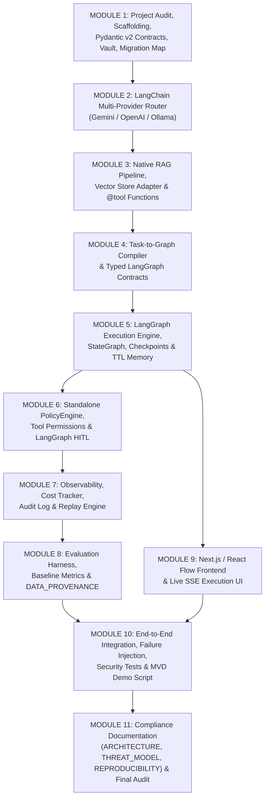

# AE-03 Unified Agentic AI Orchestrator — Implementation Plan (Directive V2)

> **Directive Version**: Master Architecture + Security + Implementation + Validation Directive V2  
> **Source of Truth**: LangGraph + LangChain + Python 3.11+ + FastAPI + Pydantic v2 + Native `@tool` Functions  
> **Rule**: Strict 11-Module Build Sequence with Step-Gate Protocol (One module at a time, stop & wait for approval)  

---

## 1. Executive Summary & Critical Architecture Pivot

Master Directive V2 mandates an architecture pivot from the previous prototype (which used custom Kahn DAG topological sorting and external n8n webhooks) to a production-grade, model-independent platform built on **LangGraph, LangChain, and Native `@tool` functions**:

- **Removed Execution Architecture**: n8n workflows/webhooks/clients, custom Kahn DAG execution (`executor.py`), custom topological sorting (`validator.py`), custom workflow scheduling.
- **Final Execution Architecture**:
  - **LangGraph** (`StateGraph`, checkpointer, interrupts, conditional routing, retries, recovery) as the sole execution engine.
  - **LangChain** (`BaseChatModel`, `langchain-google-genai` / `ChatGoogleGenerativeAI` primary provider, OpenAI and Ollama fallback providers).
  - **Native `@tool` Functions** (`similarity_search`, `analyze_dataset`, `retrieve_public_document`, `generate_visualization`, `calculate_metric`, `public_search`).
  - **Native RAG Pipeline** (`RecursiveCharacterTextSplitter` 1000/200, Chroma/FAISS, `GoogleGenerativeAIEmbeddings`/`HuggingFaceEmbeddings`, `VectorStoreAdapter`, workspace isolation).
  - **Deterministic PolicyEngine** (`/backend/safety/policy_engine.py`) enforcing deny-by-default security, prompt-injection scanner, and resource/run budgets.
  - **Real LangGraph HITL** (`interrupt()` / resume via API endpoints).

---

## 2. 11 Logical Agent Roles & Responsibilities Matrix

Per Directive V2 Sections 9, 15, 28, and 35, the system implements 11 specialized agent roles:

| Agent Role | Primary Responsibility | Allowed Tool Capabilities |
| :--- | :--- | :--- |
| **1. ORCHESTRATOR** | Top-level execution coordinator. Controls run initialization, budget enforcement, high-level graph routing, and state lifecycle. | System management, graph dispatch |
| **2. PLANNER** | Converts natural-language user goals into structured task plans and typed DAG execution nodes. | `task_planning` |
| **3. RESEARCHER** | Searches public sources and repository metadata. Collects evidence and records full source metadata (`URL`, `title`, `hash`, `relevance`, `quality`). | `public_search`, `public_document_retrieval`, `repository_metadata` |
| **4. RAG AGENT** | Performs semantic search and vector retrieval over ingested workspace documents with strict workspace isolation. | `similarity_search`, `document_retrieval` |
| **5. TOOL / EXECUTION** | Executes safe data transformations, dataset analysis, and computational tasks assigned in the task plan. | Native `@tool` functions |
| **6. ANALYST** | Evaluates raw evidence collected by Researcher & RAG agents, performs data calculations, and synthesizes structured conclusions. | `data_analysis`, `calculator` |
| **7. CRITIC** | Independently evaluates Analyst conclusions for correctness, evidence coverage, math accuracy, and task coverage. Triggers bounded replanning (max 3 iterations). | Internal evaluation checks, replanning |
| **8. VERIFIER** | Independently validates final artifacts and schemas. Ensures generation steps cannot self-declare correctness. | Schema & artifact validation |
| **9. SECURITY / POLICY** | Evaluates tool permission requests, scans untrusted content for prompt-injection attacks, audits execution logs, and enforces deny-by-default rules. | `policy_evaluation`, `audit` |
| **10. REPORTER** | Synthesizes verified artifacts, evidence, and research findings into human-readable final reports. Triggers HITL approval when high-risk actions occur. | `verified_artifact_retrieval` |
| **11. VISUALIZATION** | Generates visual representations of workflow execution, node statuses, metrics, and charts for display on the frontend React Flow canvas. | `visualization` |

---

## 3. Strict 11-Module Build Sequence



---

## 4. Proposed Changes per Module

---

### MODULE 1: Project Audit, Scaffolding, Pydantic v2 Contracts, Environment/Vault & Migration Map

**Goal**: Complete project audit, clean up obsolete n8n dependencies, set up Pydantic v2 typed contracts, and update environment configuration.

#### [NEW] [docs/PROJECT_AUDIT.md](file:///c:/hack/docs/PROJECT_AUDIT.md)
Comprehensive audit documenting component responsibilities, dependencies, migration actions (KEEP/MODIFY/REMOVE), replacements, and migration risks.

#### [NEW] [docs/N8N_MIGRATION_MAP.md](file:///c:/hack/docs/N8N_MIGRATION_MAP.md)
Mapping matrix for removing obsolete n8n execution components and replacing them with native LangGraph / LangChain `@tool` constructs.

#### [DELETE] [n8n_workflows/](file:///c:/hack/n8n_workflows) & [backend/integrations/n8n_client.py](file:///c:/hack/backend/integrations/n8n_client.py)
Remove obsolete n8n workflow JSONs and n8n HTTP client.

#### [MODIFY] [requirements.txt](file:///c:/hack/requirements.txt)
Update dependencies to include:
- `langchain>=0.3.0`, `langgraph>=0.2.0`
- `langchain-google-genai>=2.0.0`, `langchain-openai>=0.2.0`, `langchain-community>=0.3.0`
- `chromadb>=0.5.0`, `faiss-cpu>=1.8.0`, `sentence-transformers>=3.0.0`
- `fastapi>=0.115.0`, `pydantic>=2.10.0`, `pydantic-settings>=2.5.0`

#### [MODIFY] [backend/config.py](file:///c:/hack/backend/config.py) & [.env.example](file:///c:/hack/.env.example)
Add environment variables per Directive V2 Section 6:
```env
PRIMARY_PROVIDER=google
PRIMARY_MODEL=gemini-1.5-pro
GOOGLE_API_KEY=AI...
GOOGLE_MODEL=gemini-1.5-pro
OPENAI_API_KEY=sk-...
OPENAI_MODEL=gpt-4o
OLLAMA_BASE_URL=http://localhost:11434
OLLAMA_MODEL=llama3.2
MAX_RUNTIME_SECONDS=300
MAX_TOKENS=100000
MAX_COST=5.0
SCRATCHPAD_TTL_SECONDS=300
MAX_SCRATCHPAD_ENTRIES=100
```

#### [MODIFY] [backend/schemas/contracts.py](file:///c:/hack/backend/schemas/contracts.py)
Pydantic v2 data models per Directive V2 Section 13:
- `AgentConfig`, `ToolConfig`, `Task`, `TaskGraph`, `AgentMessage`, `Artifact`, `ToolRequest`, `ToolResult`, `RunState`, `ApprovalRequest`, `SecurityDecision`, `ResearchSource`, `RAGDocument`, `RAGChunk`, `VerificationResult`, `RunMetrics`.

---

### MODULE 2: LangChain Multi-Provider Model Router (Gemini / OpenAI / Ollama)

**Goal**: Model-independent provider router built on LangChain `BaseChatModel`.

#### [NEW] [backend/models/model_router.py](file:///c:/hack/backend/models/model_router.py)
Create `ModelRouter` class handling:
- Primary LLM: `ChatGoogleGenerativeAI` (`langchain-google-genai`)
- Fallback 1: `ChatOpenAI` (`langchain-openai`)
- Fallback 2: `ChatOllama` (`langchain-community`)
- Automatic fallback chain, timeouts, retries, rate-limit handling, token & cost tracking, capability selection, availability checks.

---

### MODULE 3: Native RAG Pipeline, Vector Store Adapter & Native `@tool` Functions

**Goal**: Production RAG pipeline and native LangChain tools.

#### [NEW] [backend/rag/pipeline.py](file:///c:/hack/backend/rag/pipeline.py)
RAG pipeline using `RecursiveCharacterTextSplitter` (`chunk_size=1000`, `chunk_overlap=200`).  
Pipeline stages: `DOCUMENT` -> `VALIDATION` -> `SAFE EXTRACTION` -> `NORMALIZATION` -> `CHUNKING` -> `EMBEDDING` -> `VECTOR STORE` -> `SIMILARITY SEARCH` -> `OPTIONAL RERANKING` -> `AGENT CONTEXT`.

#### [NEW] [backend/rag/vector_store.py](file:///c:/hack/backend/rag/vector_store.py)
`VectorStoreAdapter` abstracting storage (Chroma / FAISS) with `GoogleGenerativeAIEmbeddings` or `HuggingFaceEmbeddings`. Enforces workspace isolation authorization metadata.

#### [NEW] [backend/tools/native_tools.py](file:///c:/hack/backend/tools/native_tools.py)
Native `@tool` functions defining name, description, input schema, output schema, risk level, allowed agents, approval requirement, resource limits:
- `similarity_search`
- `analyze_dataset`
- `retrieve_public_document`
- `generate_visualization`
- `calculate_metric`
- `public_search`

---

### MODULE 4: Prompt Architecture & Task-to-Graph Compiler

**Goal**: Converts natural language goals into validated typed LangGraph workflows.

#### [NEW] [backend/graph/task_compiler.py](file:///c:/hack/backend/graph/task_compiler.py)
Converts: `NATURAL LANGUAGE GOAL` -> `STRUCTURED PLAN` -> `VALIDATED TASK GRAPH` -> `LANGGRAPH WORKFLOW`.  
Pre-execution validation: unknown agents, invalid tools, circular dependencies, missing dependencies, excessive parallelism, unauthorized side effects, invalid schemas, impossible tasks, budget violations.

---

### MODULE 5: LangGraph Execution Engine, State, Checkpoints & TTL Memory

**Goal**: Replace all custom DAG execution code with native LangGraph `StateGraph`.

#### [DELETE] [backend/engine/executor.py](file:///c:/hack/backend/engine/executor.py) & [backend/compiler/validator.py](file:///c:/hack/backend/compiler/validator.py)
Eliminate obsolete custom Kahn topological sort DAG executor.

#### [NEW] [backend/graph/agent_state.py](file:///c:/hack/backend/graph/agent_state.py)
Typed `AgentState` for LangGraph `StateGraph`:
`run_id`, `user_id`, `workspace_id`, `goal`, `plan`, `tasks`, `current_task`, `artifacts`, `agent_outputs`, `memory_refs`, `rag_refs`, `source_refs`, `security_events`, `approval_state`, `verification_state`, `errors`, `metrics`, `status`, `created_at`, `updated_at`.

#### [NEW] [backend/graph/workflow.py](file:///c:/hack/backend/graph/workflow.py)
LangGraph `StateGraph` implementation:
- Sequential execution, parallel branches, conditional routing, retries, recovery, state checkpoints (MemorySaver / SqliteSaver).
- Scratchpad TTL memory management (`SCRATCHPAD_TTL_SECONDS=300`, `MAX_SCRATCHPAD_ENTRIES=100`).

---

### MODULE 6: Standalone Policy Engine, Tool Permissions & LangGraph HITL

**Goal**: Deterministic deny-by-default security and native LangGraph HITL interrupts.

#### [MODIFY] [backend/safety/policy_engine.py](file:///c:/hack/backend/safety/policy_engine.py)
Deterministic `PolicyEngine`:
- Intercepts tool requests, resource access, external actions, file operations, network operations, database operations.
- Prompt-injection defense: treats external content (websites, PDFs, READMEs, search results, RAG chunks) as untrusted data.
- Deny-by-default rules.

#### [NEW] [backend/safety/agent_config.py](file:///c:/hack/backend/safety/agent_config.py)
Agent capability matrix mapping allowed tools for all 11 logical agent roles (`PLANNER`, `RESEARCHER`, `RAG`, `ANALYST`, `VISUALIZATION`, `REPORTER`, `SECURITY`, `CRITIC`, `VERIFIER`, `ORCHESTRATOR`, `TOOL_EXECUTION`).

#### [NEW] [backend/safety/hitl_gate.py](file:///c:/hack/backend/safety/hitl_gate.py)
Native LangGraph `interrupt()` integration for high-risk operations.

---

### MODULE 7: Observability, Cost Tracker, Audit Log & Replay Engine

**Goal**: Event tracing, cost tracking, audit log, and run replay.

#### [MODIFY] [backend/observability/tracker.py](file:///c:/hack/backend/observability/tracker.py) & [tracer.py](file:///c:/hack/backend/observability/tracer.py)
Emit structured events (`RUN_CREATED`, `PLAN_CREATED`, `GRAPH_COMPILED`, `SECURITY_CHECK`, `TOOL_REQUESTED`, `TOOL_ALLOWED`, `TOOL_DENIED`, `TOOL_EXECUTED`, `AGENT_STARTED`, `AGENT_COMPLETED`, `AGENT_FAILED`, `RETRY`, `REPLAN`, `RAG_SEARCH`, `SOURCE_RETRIEVED`, `CRITIC_STARTED`, `CRITIC_FAILED`, `VERIFICATION_STARTED`, `APPROVAL_REQUESTED`, `APPROVED`, `REJECTED`, `REPORT_CREATED`, `RUN_COMPLETED`). Immutable audit log for security/workflow events.

#### [MODIFY] [backend/observability/replay.py](file:///c:/hack/backend/observability/replay.py)
Run replay engine utilizing saved LangGraph thread state checkpoints.

---

### MODULE 8: Evaluation Harness, Baseline Metrics & DATA_PROVENANCE

**Goal**: Comparative evaluation between Single-Agent Baseline and Multi-Agent Orchestrator.

#### [MODIFY] [backend/evaluation/benchmark.py](file:///c:/hack/backend/evaluation/benchmark.py) & [tasks.py](file:///c:/hack/backend/evaluation/tasks.py)
Evaluate benchmarks from `evaluation/DATA_PROVENANCE.md` (AgentBench, SWE-bench Lite).  
Compare Single-Agent Baseline vs LangGraph Orchestrator on success rate, answer quality, evidence coverage, handoff correctness, verification pass rate, security violations, token usage, cost, latency, recovery rate.

---

### MODULE 9: Existing Next.js/React Frontend, React Flow & Live SSE Execution UI

**Goal**: Bind existing Next.js + React Flow frontend to new LangGraph execution API & SSE event stream.

#### [MODIFY] [frontend/app/page.tsx](file:///c:/hack/frontend/app/page.tsx) & [components/GraphCanvas.tsx](file:///c:/hack/frontend/components/GraphCanvas.tsx)
- Connect React Flow canvas to render LangGraph state nodes & transitions.
- Bind SSE stream (`GET /api/runs/{run_id}/events`).
- Display workflow graph, active agent, node status, tool calls, approvals, costs, tokens, latency, security events, and final deliverable output.

---

### MODULE 10: End-to-End Integration, Failure Injection, Security Tests & MVD Demo Script

**Goal**: Full system API integration, security test suite (50 security tests across 18 categories), failure injection, and single-command demo launcher.

#### [MODIFY] [backend/api/routes.py](file:///c:/hack/backend/api/routes.py) & [main.py](file:///c:/hack/backend/main.py)
API endpoints per Directive V2 Section 45:
- `POST /api/run`
- `GET /api/run/{run_id}`
- `POST /api/run/{run_id}/cancel`
- `GET /api/run/{run_id}/trace`
- `GET /api/run/{run_id}/artifacts`
- `POST /api/workflow/approve/{run_id}`
- `POST /api/workflow/reject/{run_id}`
- `POST /api/workflow/request-changes/{run_id}`
- `POST /api/documents/upload`
- `POST /api/rag/query`
- `GET /api/health`
- SSE: `GET /api/runs/{run_id}/events`

#### [NEW] [backend/tests/test_security_suite.py](file:///c:/hack/backend/tests/test_security_suite.py)
Automated test suite verifying all 50 security tests (unauthorized tool call, unauthorized agent capability, prompt injection, malicious RAG document, cross-workspace retrieval, SSRF, fake HITL approval, circular graph, etc.).

---

### MODULE 11: Compliance Documentation & Final Audit

**Goal**: Mandatory compliance documentation.

#### [MODIFY] [docs/ARCHITECTURE.md](file:///c:/hack/docs/ARCHITECTURE.md)
Update architecture documentation with LangGraph architecture, tool architecture, PolicyEngine, RAG, HITL, replay, security boundaries, and migration from n8n / custom DAG.

#### [MODIFY] [docs/THREAT_MODEL.md](file:///c:/hack/docs/THREAT_MODEL.md)
Cover 15 threat categories (prompt injection, tool abuse, unauthorized data access, secret leakage, malicious documents, SSRF, resource exhaustion, workflow manipulation, etc.).

#### [MODIFY] [docs/REPRODUCIBILITY.md](file:///c:/hack/docs/REPRODUCIBILITY.md)
Update reproducibility guide with Python version, dependency versions, model configuration, RAG setup, test/demo commands.

---

## 5. Verification Plan & Step-Gate Protocol

Per Directive V2 Section 55:
- Execute ONLY ONE MODULE AT A TIME.
- For every module: inspect dependencies, implement module, run formatting/linting, syntax/type checks, unit tests, integration tests, security tests, verify existing functionality, check for regressions, update documentation, report exact files changed, STOP.
- Output `[ANTIGRAVITY STEP GATE X]` and wait for explicit approval before proceeding to Module X+1.
